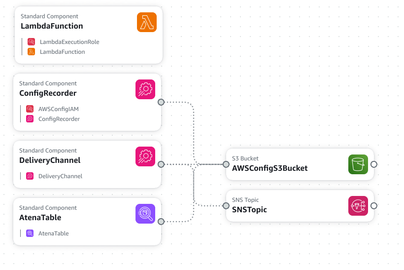

# Purpose
query AWS confg data using athena to exatract insightfulll infromation from aws resources configuration state , for this i create this cloudformation template craete all nessasary resources , to be able to query the data after usng only sql query on the optimal way .



# Installation 

After configuring the aws access for the your user , you need to create new cloudformation template using this command :

```bash
aws cloudformation create-stack --stack-name ConfigWithAthena --template-body file://templates/athena.yml

```

# Test

To test the solution you can create new query in athena , for example :
```sql
SELECT configurationItem.resourceType, configurationItem.resourceId as InstanceId
FROM default.aws_config_configuration_snapshot
CROSS JOIN UNNEST(configurationitems) AS t(configurationItem)
WHERE dt = 'latest'
AND configurationItem.resourceType = 'AWS::EC2::Instance'
AND json_extract_scalar(configurationItem.configuration, '$.instancetype') = 't2.micro';

```